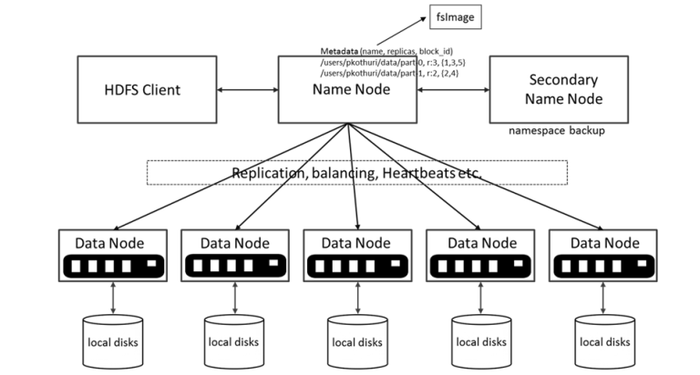

# Learning outcome


By the end of this lesson, you are able to

* Setup a Multi-node Hadoop cluster (and Spark cluster)
* Manage HDFS using Command Line Interface
* Execute Simple MapReduce Job
* Design and implement mapreduce job


# Prelude - Please attempt this before the lab


Since we are using AWS EC2, setting up a hadoop cluster is pretty straight forward. 

We are going to rely on an open source project `Flintrock` which aims to automate the setup of 
a Spark cluster. Since in most of the use cases, Spark requires a distributed data storage, Flinkrock supports
HDFS out of the box.

**I recommend you watch the video tutorial of how to set up a cluster on EC2 with flintrock.** This text guide can serve as an additional reference. If you watch the video on eDimension, you may skip to Step 4. 

## Step 1: Preparation

Assume that we have already setup an AWS IAM user with an access key and an access secret. 
If the user has not been created, create one by recalling the steps from Lab 1, `boto3` exercise.

If you are using AWS educate account you should be able to find the IAM access id and secret here


We also need to have a client machine which is running Linux or Mac OS X. 
If Windows is the only installed OS, we can try to install a Windows Linux Subsystem or a VM.

Make sure `boto3` is installed.

## Step 2: Setup


1. Launch a bash / zsh terminal and install flintrock

```bash
$ sudo pip3 install flintrock
```
when the installation completes, type 

```bash
$ flintrock

Usage: flintrock [OPTIONS] COMMAND [ARGS]...

  Flintrock

  A command-line tool for launching Apache Spark clusters.

Options:
  --config TEXT         Path to a Flintrock configuration file.
  --provider [ec2]
  --version             Show the version and exit.
  --debug / --no-debug  Show debug information.
  --help                Show this message and exit.

Commands:
  add-slaves     Add slaves to an existing cluster.
  configure      Configure Flintrock's defaults.
  copy-file      Copy a local file up to a cluster.
  describe       Describe an existing cluster.
  destroy        Destroy a cluster.
  launch         Launch a new cluster.
  login          Login to the master of an existing cluster.
  remove-slaves  Remove slaves from an existing cluster.
  run-command    Run a shell command on a cluster.
  start          Start an existing, stopped cluster.
  stop           Stop an existing, running cluster.

```

2. Initialize the Flintrock configuration file

```bash
$ flintrock configure
```

A configuration file `~/.config/flintrock/config.yaml` is generated. 

3. Open the `config.yaml` file with a text editor and update the content similar 
to the following

```yaml
services:
  spark:
    version: 3.1.2
    download-source: "https://archive.apache.org/dist/spark/spark-3.1.2/"
  hdfs:
    version: 3.2.0
    download-source: "https://archive.apache.org/dist/hadoop/common/hadoop-3.2.0/"

provider: ec2

providers:
  ec2:
    key-name: <the_pem_key_name_you_used_when_creating_pem_file>
    identity-file: <path_to_your_pem_file.pem>
    # key-name: kenny_lu_sutd_aws_us_east1
    # identity-file: /home/luzm/kenny_lu_sutd_aws_us_east1.pem
    instance-type: t2.medium
    # instance-type: m5.large
    region: us-east-1
    # availability-zone: <name>
    ami: ami-0b5eea76982371e91 # Amazon Linux 2 5.10
    user: ec2-user
    tenancy: default  # default | dedicated
    ebs-optimized: no  # yes | no
    instance-initiated-shutdown-behavior: terminate  # terminate | stop

launch:
  num-slaves: 3
  install-hdfs: true
  install-spark: true
  java-version: 8

debug: true

```

4. Export the AWS IAM key id and secret as environment variables, or directly edit the file `~/.aws/credentials`, and copy paste the session information from your aws lab (see video). 

```bash 
$ export AWS_ACCESS_KEY_ID=<YOUR_KEY_ID>
$ export AWS_SECRET_ACCESS_KEY=<YOUR_ACCESS_KEY>

```

## Step 3: Launch the cluster

1. Launch the cluster 

```bash 
$ flintrock launch my_test_cluster

```
We should see something similar to the following: 

```bash
2021-06-29 10:23:24,074 - flintrock.ec2       - INFO  - Launching 4 instances...
2021-06-29 10:23:36,628 - flintrock.ec2       - DEBUG - 4 instances not in state 'running': 'i-0945e74dada74d6fe', 'i-04203f2cc9024658a', 'i-0c1a00af39d307d72', ...
2021-06-29 10:23:39,781 - flintrock.ec2       - DEBUG - 4 instances not in state 'running': 'i-0945e74dada74d6fe', 'i-0c1a00af39d307d72', 'i-04203f2cc9024658a', ...
2021-06-29 10:23:42,883 - flintrock.ec2       - DEBUG - 3 instances not in state 'running': 'i-0945e74dada74d6fe', 'i-0c1a00af39d307d72', 'i-0dcf4482176f3230f', ...
2021-06-29 10:23:45,954 - flintrock.ec2       - DEBUG - 3 instances not in state 'running': 'i-0945e74dada74d6fe', 'i-0c1a00af39d307d72', 'i-0dcf4482176f3230f', ...
2021-06-29 10:23:49,062 - flintrock.ec2       - DEBUG - 1 instances not in state 'running': 'i-0945e74dada74d6fe', ...
2021-06-29 10:23:52,731 - flintrock.ssh       - DEBUG - [13.212.89.251] SSH exception: [Errno None] Unable to connect to port 22 on 13.212.89.251
2021-06-29 10:23:55,727 - flintrock.ssh       - DEBUG - [13.250.65.255] SSH timeout.
2021-06-29 10:23:55,731 - flintrock.ssh       - DEBUG - [13.212.245.73] SSH timeout.
2021-06-29 10:23:55,731 - flintrock.ssh       - DEBUG - [52.77.217.139] SSH timeout.
2021-06-29 10:23:58,208 - flintrock.ssh       - INFO  - [13.212.89.251] SSH online.
2021-06-29 10:23:58,513 - flintrock.core      - INFO  - [13.212.89.251] Configuring ephemeral storage...
2021-06-29 10:24:00,860 - flintrock.ssh       - DEBUG - [52.77.217.139] SSH exception: [Errno None] Unable to connect to port 22 on 52.77.217.139
2021-06-29 10:24:01,178 - flintrock.ssh       - INFO  - [13.212.245.73] SSH online.
2021-06-29 10:24:01,444 - flintrock.ssh       - INFO  - [13.250.65.255] SSH online.
2021-06-29 10:24:01,476 - flintrock.core      - INFO  - [13.212.245.73] Configuring ephemeral storage...
2021-06-29 10:24:01,812 - flintrock.core      - INFO  - [13.250.65.255] Configuring ephemeral storage...
2021-06-29 10:24:07,219 - flintrock.ssh       - INFO  - [52.77.217.139] SSH online.
2021-06-29 10:24:07,504 - flintrock.core      - INFO  - [52.77.217.139] Configuring ephemeral storage...
2021-06-29 10:24:10,991 - flintrock.core      - INFO  - [13.212.89.251] Installing AdoptOpenJDK Java 8...
2021-06-29 10:24:14,126 - flintrock.core      - INFO  - [13.250.65.255] Installing AdoptOpenJDK Java 8...
2021-06-29 10:24:17,606 - flintrock.core      - INFO  - [13.212.245.73] Installing AdoptOpenJDK Java 8...
2021-06-29 10:24:17,848 - flintrock.core      - INFO  - [52.77.217.139] Installing AdoptOpenJDK Java 8...
2021-06-29 10:24:45,125 - flintrock.services  - INFO  - [13.212.89.251] Installing HDFS...
2021-06-29 10:24:45,227 - flintrock.services  - DEBUG - [13.212.89.251] Downloading Hadoop from: https://archive.apache.org/dist/hadoop/common/hadoop-3.2.0/hadoop-3.2.0.tar.gz
2021-06-29 10:24:50,611 - flintrock.services  - INFO  - [13.250.65.255] Installing HDFS...
2021-06-29 10:24:50,702 - flintrock.services  - DEBUG - [13.250.65.255] Downloading Hadoop from: https://archive.apache.org/dist/hadoop/common/hadoop-3.2.0/hadoop-3.2.0.tar.gz
2021-06-29 10:24:54,621 - flintrock.services  - INFO  - [13.212.245.73] Installing HDFS...
2021-06-29 10:24:54,743 - flintrock.services  - DEBUG - [13.212.245.73] Downloading Hadoop from: https://archive.apache.org/dist/hadoop/common/hadoop-3.2.0/hadoop-3.2.0.tar.gz
2021-06-29 10:24:56,392 - flintrock.services  - INFO  - [52.77.217.139] Installing HDFS...
2021-06-29 10:24:56,488 - flintrock.services  - DEBUG - [52.77.217.139] Downloading Hadoop from: https://archive.apache.org/dist/hadoop/common/hadoop-3.2.0/hadoop-3.2.0.tar.gz
2021-06-29 10:25:44,608 - flintrock.services  - INFO  - [13.212.89.251] Installing Spark...
2021-06-29 10:25:44,720 - flintrock.services  - DEBUG - [13.212.89.251] Downloading Spark from: https://archive.apache.org/dist/spark/spark-3.1.2/spark-3.1.2-bin-hadoop3.2.tgz
2021-06-29 10:25:53,303 - flintrock.services  - INFO  - [13.250.65.255] Installing Spark...
2021-06-29 10:25:53,420 - flintrock.services  - DEBUG - [13.250.65.255] Downloading Spark from: https://archive.apache.org/dist/spark/spark-3.1.2/spark-3.1.2-bin-hadoop3.2.tgz
2021-06-29 10:25:54,856 - flintrock.services  - INFO  - [13.212.245.73] Installing Spark...
2021-06-29 10:25:54,966 - flintrock.services  - DEBUG - [13.212.245.73] Downloading Spark from: https://archive.apache.org/dist/spark/spark-3.1.2/spark-3.1.2-bin-hadoop3.2.tgz
2021-06-29 10:25:58,834 - flintrock.services  - INFO  - [52.77.217.139] Installing Spark...
2021-06-29 10:25:58,942 - flintrock.services  - DEBUG - [52.77.217.139] Downloading Spark from: https://archive.apache.org/dist/spark/spark-3.1.2/spark-3.1.2-bin-hadoop3.2.tgz
2021-06-29 10:26:36,881 - flintrock.services  - INFO  - [52.77.217.139] Configuring HDFS master...
2021-06-29 10:27:01,910 - flintrock.services  - INFO  - [52.77.217.139] Configuring Spark master...
2021-06-29 10:27:11,842 - flintrock.services  - INFO  - HDFS online.
2021-06-29 10:27:12,049 - flintrock.services  - INFO  - Spark online.
2021-06-29 10:27:12,053 - flintrock.ec2       - INFO  - launch finished in 0:03:55.
Cluster master: ec2-52-77-217-139.ap-southeast-1.compute.amazonaws.com
Login with: flintrock login test_cluster
```

If you have any issues, make sure all dependencies are installed, your credentials are working (they refresh often), and you double check the video on eDimension so you don't skip any steps. 

You only have to run launch one time to install the cluster. To log in, you just use the instructions in Step 4 below. 


## Step 4: Test drive the cluster

1. Login to the cluster
```bash
$ flintrock login <your_cluster_name>
```

We should see 

```bash
Warning: Permanently added '52.77.217.139' (ECDSA) to the list of known hosts.
Last login: Tue Jun 29 02:27:01 2021 from 66.96.210.124

       __|  __|_  )
       _|  (     /   Amazon Linux 2 AMI
      ___|\___|___|

https://aws.amazon.com/amazon-linux-2/
29 package(s) needed for security, out of 38 available
Run "sudo yum update" to apply all updates.
[ec2-user@ip-172-31-41-151 ~]$ 
```

Alternatively, you can directly ssh into the master node, whose IP address you can find in the Amazon EC2 instances panel. 


## Trouble Shooting

1. We encounter the following error

```
Flintrock could not find your AWS credentials. You can fix this by providing your credentials via environment variables or by creating a shared credentials file.
```
when launching the cluster

Make sure the ACCESS KEY and SECRET are exported as environment variables.

2. We encounter the following error when launching the cluster

```bash
error:
    raise Exception("HDFS health check failed.") from e
Exception: HDFS health check failed.
```

Edit the config.yaml to use Java 8

IF the Java version has already been set to 8. Try to destroy the cluster and launch again.


## High level of Architecture of Hadoop

Recall that Hadoop consists of the following three major components

* MapReduce - Data Processing Layer
* Hadoop Distributed File System - Data Storage Layer
* Yarn - Resource Management Layer


## HDFS


Recall the HDFS architecture

{width=100%}

* A Master-worker architecture
* Block Size (default 64MB v1, 128MB v2+)
* Each block is replicated (Recommended 3 or any odd number > 3)
* Name node maps filename/path to block IDs
* Client fetches actual data using the block IDs


## HDFS dfs operations

* File uploading
```bash
hdfs dfs -put <local_file_path> <hdfs_file_path>
```

Note that the file path in hdfs must be a full path.

* File downloading
```bash
hdfs dfs -get <hdfs_file_path> <local_file_path>
```

* File listing
```bash
hdfs dfs -ls [optios] <hdfs_file_path>
```

* File deleting

```bash
hdfs dfs -rm [optios] <hdfs_file_path>
```


* File copying

```bash
hdfs dfs -cp [optios] <src_hdfs_file_path> <target_hdfs_file_path>
```

* File moving/renaming

```bash
hdfs dfs -mv [optios] <src_hdfs_file_path> <target_hdfs_file_path>
```

* For more hdfs dfs commands, try `hdfs dfs`. You may realize many HDFS dfs sub commands are *borrowed* from Linux bash.


## HDFS namenode operations

* Namenode format (for setting up only)

```bash
hdfs namenode -format
```

## HDFS admin operations


* Admin report 

```bash
hdfs dfsadmin -report 
```

* Safemode - the name node is in read-only mode.
   * If your cluster (in particular namenode) crashes, its next startup might be stuck in safe mode.
   * to check 
   ```bash
   hdfs dfsadmin -safemode get
   ```
   * to manually exit safemode
   ```bash
   hdfs dfsadmin -safemode leave
   ```
   
* For more hdfs admin, try `hdfs dfsadmin`
   


## Prelude Exercise 

Assuming we have launch the hadoop cluster using FlintRock


1. clone the lab work repo from github (if git is not installed, install it by issuing `sudo yum install git`)
```bash
$ mkdir -p ~/git
$ cd ~/git
$ git clone https://github.com/istd50043-2023-spring/cohort_problems/ 
```

2. transfer the file in `~/git/istd50043-2023-spring/cohort_problems/cc10/data/TheCompleteSherlockHolmes.txt` to the folder `/input/` in HDFS.

After the transfer, you should find the file `TheCompleteSherlockHolmes.txt` in the HDFS folder `/input/`.


3. test your cluster with the following map reduce job.

```bash
$ hadoop jar /home/ec2-user/hadoop/share/hadoop/mapreduce/hadoop-mapreduce-examples-3.2.0.jar \
wordcount /input /output
```
Note: you might need to make sure that the output folder DOES NOT exist before the execution of the above command.

4. transfer the result from the folder `/output/` in hdfs back to the linux file system.


## Shutdown the session

To safely terminate your cluster, on the master node, run: 

```bash
/home/ec2-user/hadoop/sbin/stop-all.sh
/home/ec2-user/spark/sbin/stop-all.sh
```

Then type `exit` to log out of the flintrock session/ssh. 


## End of Prelude: Terminate the cluster (Do it when you need to)

Back to our client machine.

```bash
$ flintrock destroy <your_cluster_name>

```

Not that you loose everything you installed on the cluster. 


# Start with the Toy MapReduce library

During the lecture, we developed a toy MapReduce library in Python. It is sometimes useful to design 
Map Reduce jobs in this toy library before diving into the specific implementation such as 
Hadoop MapReduce or Spark.

Recall that `map` and `reduce` are the two basic combinators/functions that enable data parallelism.

Leveraging the two combinators, we built the following combinators

* `filter`
* `flatMap`
* `shuffle`
* `reduceByKey` and `reduceByKey2`


# Exercise 1:

The first few exercises are run locally on your machine using the toy library. 


Define `min()` and `max()` using `reduce()`. 

Sample test cases

```python
>>> import ex1
>>> min([32,63,7,10, 100])
7
>>> max([32,63,7,10, 100])
100
```


# Exercise 2: 

Suppose you have a big data set (many terabytes) with many records of the following form:
`(productID, supplierID, price)`
where `productID` identifies a unique product,  `supplierID` identifies a unique supplier, and price is the sale price. 
You want a list of suppliers, listing for each supplier the average sale price of all items by the supplier. 
Write a MapReduce job for this task using the toy MapReduce library.

You may find the toy MapReduce library `mapreduce.py` in `~/git/istd50043-2023-spring/cohort_problems/cc10/ex2/` with some example code
`wordcount.py`.

Complete the following: 


```python
from mapreduce import *

def read_db(filename):
    db = []
    with open(filename, 'r') as f:
        for l in f:
            db.append(l)
    f.close()
    return db
            
test_db = read_db("./data/price.csv")

# TODO: FIXME
# the result should contain a list of suppliers, 
# with the average sale price for all items by this supplier.
result = []

# print the results
for supplier,avg_price in result:
    print(supplier, avg_price)
```

It's ok if you can't start straight from the toy MapReduce library.
In that case you may want to start with a version using for loops and 
dictionaries. Then from there you can start to replace loops with map,
reduce and other combinators found in the toy MapReduce library.

### mini discussion

Besides `reduceByKey2` itself, name one operation that can
only be defined using `reduceByKey2` but
not `reduceByKey`. Explain why it can't be implemented using `reduceByKey`.


# Relational Algebra and MapReduce

Recall that in Lecture 2, we learned about Relational Algebra in the
context of RDBMS. Assuming that we are dealing with tabular (CSV / TSV) data in
HDFS and we stick to bag semantics instead of set semantics, can we
implement a subset of Relational Algebra using MapReduce?

As a POC, we can use the toy MapReduce library as our MapReduce
framework and the product-supplier-price dataset in Exercise 2 as the data.

```python
test_db = read_db("./data/price.csv")
priceTable = map(lambda ln:ln.strip().split(','),test_db)
```

* Projection $\Pi_{supplierID}(priceTable)$, can be implemented as

```python
def supplierID(cols): return cols[1]
map(supplierID, priceTable)
```

* Selection $\sigma_{price>100}(priceTable)$, can be implemented as

```python
def price(cols):return cols[2]
filter(lambda x:price(x) > 100, priceTable)
```

* Aggregation $\gamma^{supplierID}_{avg(price)}(priceTable)$, we have done it
  in exercise 2.

* What about the join $\Join$? Suppose we have another CSV dataset `stockTable` with
schema "productID, stockLevel", can we implement `priceTable`
$\Join_{productID}$ `stockTable`? 

# Exercise 3: 

Assuming that we have enough memory to accomodate one table in the RAM, implement the join operation
using the toy MapReduce library.


# Exercise 4:

The concept of `map` and `reduce` is applicable even to non-linear
data structure.

## Ex 4.1 Binary Tree Data 

Given the following data structure

```python
class Tree:
    def __init__(self,value,left=None,right=None):
        self.value = value
        self.left = left
        self.right = right
    def __str__(self):
        return "{value:%s, left:%s, right:%s}" % 
		(str(self.value), str(self.left), str(self.right))
    
mytree = Tree(17, Tree(11, Tree(4), Tree(13)), Tree(5, None, Tree(30)))
```

```python
>>> str(mytree)
'{value:17, left:{value:11, left:{value:4, left:None, right:None}, 
 right:{value:13, left:None, right:None}}, right:{value:5, left:None, 
 right:{value:30, left:None, right:None}}}'
```

* Define a `tmap(f,t)` which applies `f` to all `value` elements in tree
`t`. e.g.

```python
>>> str(tmap(lambda x: x + 1, mytree))
'{value:18, left:{value:12, left:{value:5, left:None, right:None},
 right:{value:14, left:None, right:None}}, right:{value:6, left:None, 
 right:{value:31, left:None, right:None}}}'
```

* Define a `treduce(f,t,acc)` which aggregates all `value` elements in
  tree `t` with a binary function `f` and `acc` as the (initial)
  accumulator, e.g.

```python
>>> treduce(lambda x,y:x + y, mytree, 0)
80
```


## Ex 4.2 List of List Data


Given the following data

```python

myllist = [ ["one", "two", "two", "three", "three", "three"], 
           ["four", "four", "four", "four", "five"], 
		   ["five", "five", "five", "five"] ]
```

* Define a `llmap(f,ll)` function which applies `f` to all elements in the list of lists. e.g.

```python
>>> ll1 = llmap(lambda w:1, myllist)
>>> ll1
[[1, 1, 1, 1, 1, 1], [1, 1, 1, 1, 1], [1, 1, 1, 1]]
```

* Define a `llreduce(f, ll, acc)` function which applies `f` to aggregate all alements in the list of lists `ll`, e.g.

```python
>>> llreduce(lambda x,y: x + y, ll1, 0)
15
```


# Hadoop JVM API

Hadoop's JVM API is the native API. It offers

* Better performance
* Better debugging info
* Compiler and Type checking

## Wordcount 
The Hadoop MapReduce WordCount job is decribed as follows in JVM API

```java
import java.io.IOException;
import java.util.StringTokenizer;

import org.apache.hadoop.conf.Configuration;
import org.apache.hadoop.fs.Path;
import org.apache.hadoop.io.IntWritable;
import org.apache.hadoop.io.Text;
import org.apache.hadoop.mapreduce.Job;
import org.apache.hadoop.mapreduce.Mapper;
import org.apache.hadoop.mapreduce.Reducer;
import org.apache.hadoop.mapreduce.lib.input.FileInputFormat;
import org.apache.hadoop.mapreduce.lib.output.FileOutputFormat;

public class WordCount {

  public static class TokenizerMapper
       extends Mapper<Object, Text, Text, IntWritable>{

    private final static IntWritable one = new IntWritable(1);
    private Text word = new Text();

    public void map(Object key, Text value, Context context
                    ) throws IOException, InterruptedException {
      StringTokenizer itr = new StringTokenizer(value.toString());
      while (itr.hasMoreTokens()) {
        word.set(itr.nextToken());
        context.write(word, one);
      }
    }
  }

  public static class IntSumReducer
       extends Reducer<Text,IntWritable,Text,IntWritable> {
    private IntWritable result = new IntWritable();

    public void reduce(Text key, Iterable<IntWritable> values,
                       Context context
                       ) throws IOException, InterruptedException {
      int sum = 0;
      for (IntWritable val : values) {
        sum += val.get();
      }
      result.set(sum);
      context.write(key, result);
    }
  }

  public static void main(String[] args) throws Exception {
    Configuration conf = new Configuration();
    Job job = Job.getInstance(conf, "word count");
    job.setJarByClass(WordCount.class);
    job.setMapperClass(TokenizerMapper.class);
    job.setCombinerClass(IntSumReducer.class);
    job.setReducerClass(IntSumReducer.class);
    job.setOutputKeyClass(Text.class);
    job.setOutputValueClass(IntWritable.class);
    FileInputFormat.addInputPath(job, new Path(args[0]));
    FileOutputFormat.setOutputPath(job, new Path(args[1]));
    System.exit(job.waitForCompletion(true) ? 0 : 1);
  }
}
```

In the above example, the `WordCount` class contains two inner
classes, `TokenizedMapper` and `IntSumReducer`.  The former describes
the mapper task and the latter defines the reducer task.

`TokenizedMapper` extends the base class `Mapper<Object, Text, Text,
IntWritable>`. The type paraemters denote the types of the input key,
input value, output key and output value respectively. `Text` is a
serializable version of `String`. `IntWritable` is a serializable
version of `Int`. Similar observation applies to the `IntSumReducer`.

In the `main` method, we create a job instance by reading the
configuration from the current hadoop cluster. We specify the mapper
and the reducer classes as well as the input and output format.


# Exercise 5

Build and run WordCount job in JVM API.

Assuming we have some data in the HDFS folder `/input/`

We first install gradle (the Java project manager) via SDKMan


```bash
$ curl -s "https://get.sdkman.io" | bash
$ source "$HOME/.sdkman/bin/sdkman-init.sh"
$ sdk install gradle 4.4.1
```

Gradle needs more memory to run. Let's create a swapfile for it.

```bash
$ sudo dd if=/dev/zero of=/swapfile bs=1M count=2048
$ sudo mkswap /swapfile
$ sudo chmod 600 /swapfile
$ sudo swapon /swapfile

```


```bash
$ cd ~/git/istd50043-2023-spring/cohort_problems/cc10/ex5
$ gradle jar
$ hadoop jar build/libs/ex5.jar com.sutd50043.WordCount /input /output
```

Now rewrite the answer from exercise 2 using Java and run it in Hadoop.

Dont't forget to shutdown your hadoop cluster before shutting the VM.


# Appendix 1: Optional Exercise - Enabling Yarn to FlintRock Hadoop cluster

## Hadoop Python API

Pydoop is an open source library which provides Python API for Hadoop MapReduce and HDFS access.

### PyDoop Script Mode
The easiest way to get a Hadoop is to write a python script containing a mapper and a reducer.

For instance, we have a `wordcount.py` as follows
```python
def mapper(key, text, writer): 
    for word in text.split():
        writer.emit(word, "1")

def reducer(word, icounts, writer):
    writer.emit(word, sum(map(int, icounts)))
```

To run it
```bash
$ pydoop script wordcount.py /input /output
```

### PyDoop Submit Mode

Besides script mode, Pydoop supports *submit* mode

For instance, the word count example can be written as follows,

```python
import pydoop.mapreduce.api as api
import pydoop.mapreduce.pipes as pipes

class Mapper(api.Mapper):
    def map(self, context):
        for w in context.value.split():
            context.emit(w, 1)

class Reducer(api.Reducer):
    def reduce(self, context):
        context.emit(context.key, sum(context.values))

FACTORY = pipes.Factory(Mapper, reducer_class=Reducer)

def main():
    pipes.run_task(FACTORY)

if __name__ == "__main__":
    main()
```
`Factory` is an abstraction for a mapreduce job. 

Suppose the above Python code is saved in a file named `wc.py`. we can
submit it as a job,

```bash
pydoop submit --upload-file-to-cache wc.py wc input output
```

### PyDoop HDFS api

PyDoop provides access to HDFS in Python. For details refer to the online documentation.
```url
https://crs4.github.io/pydoop/index.html
```


### Setup PyDoop in your Hadoop cluster 


Prerequesite: You have setup your hadoop-spark cluster using flintrock. 

By default, the Hadoop cluster produced by FlintRock does not enable **Yarn**. Jobs are executed as 
stand-alone mode. PyDoop cannot run in stand-alone mode. To enable YARN on a FlintRock Hadoop cluster, requires more work. Some of the following steps were adopted from `https://github.com/nchammas/flintrock/issues/175`. **This will be useful for later labs too, so good to install. ** 

1. Check out the script `setup_pydoop.sh` and configuration files
`yarn-site.xml` and `mapred-site.xml` from the `~/git//istd50043-2023-spring/cohort_problems/cc10/` folder.


2. Edit the `yarn-site.xml` by replacing `<private ip of master note>` with the appropriate value 

```xml
<configuration>

    <property>
        <name>yarn.resourcemanager.hostname</name>
        <value><private ip of master note></value>
    </property>
    <property>
        <name>yarn.log-aggregation-enable</name>
        <value>true</value>
    </property>

</configuration>

```

3. Run the following on you *local* machine. 

```bash
$ flintrock copy-file my-test-cluster setup-pydoop.sh /home/ec2-user/
$ flintrock run-command my-test-cluster bash /home/ec2-user/setup-pydoop.sh
$ flintrock copy-file  my-test-cluster mapred-site.xml /home/ec2-user/hadoop/conf/
$ flintrock copy-file my-test-cluster yarn-site.xml /home/ec2-user/hadoop/conf/
$ flintrock copy-file my-test-cluster enable-yarn.sh /home/ec2-user/
$ flintrock run-command my-test-cluster 'sh ~/enable-yarn.sh'
```

4. Login to the master node (flintrock login my-test-cluster)

```bash 
$ /home/ec2-user/hadoop/sbin/stop-all.sh
$ /home/ec2-user/hadoop/sbin/start-all.sh
```
For some reason, the above scripts can't be run via flintrock

# Exercise 6

Continue with the problem statement from exercise 2, solve the problem
using Pydoop.

You may want to use the given script `generate.py` found in
`~/git//istd50043-2023-spring/cohort_problems/cc10/ex6/` to generate data. The usage is as
follow

```bash
$ python3 generate.py <number_of_records> <file_name>
```
Then you may upload the data to HDFS.


### Hints
1. The answer to exercise 6 is a slight modification of the answer
to exercise 2.
2. If you are using Python 3, the second arg of the reducer is a
generator, not a list.  


# Appendix 2: Optional Exercise - Setting up Hadoop Cluster Manually 


Let's setup a multi node hadoop cluster manually.


## Step 1: Preparation


Assuming we are using AWS EC2, provision 4 Linux servers, (you can
choose to have more). It is recommended to have the following
configuration for each node

* Ubuntu 18.04 LTS
* t2.xlarge
* disk space 32GB +
* they must be in the same region, same subnet
* port 22 must be open

For instance, we name the 4 nodes as follows, 

* fury (namenode with IP 172.20.129.147)
* ironman (datanode1 with IP 172.20.170.15)
* capt (datanode2 with IP 172.20.170.16)
* hulk (datanode3 with IP 172.20.170.17)


The IP addresses are fictional, we need to replace them obtain the actual ones


Create a common user, e.g. `hadoop` for all the nodes.

## Step 2: Setup the hostname

In this section, we illustrate on how to setup the host names. 
The objective of setting up the host names is to ensure that nodes in
the cluster have a common naming convention for inter host
communication. It is recommended to use fully qualified domain names
(FQDNs). We do not need to register these names with DNS nor setup a DNS
server for now.

* com.avg.fury
* com.avg.ironman
* com.avg.capt
* com.avg.hulk

Edit the file `/etc/hosts` in all nodes in the cluster according to the
following, 

```bash
127.0.0.1       localhost

172.20.129.147  com.avg.fury
172.20.170.15   com.avg.ironman
172.20.170.16   com.avg.capt
172.20.170.17  com.avg.hulk

# The following lines are desirable for IPv6 capable hosts
::1     ip6-localhost ip6-loopback
fe00::0 ip6-localnet
ff00::0 ip6-mcastprefix
ff02::1 ip6-allnodes
ff02::2 ip6-allrouters
```

You might want to update the `/etc/hostname` individually for the ease
of identification during ssh sessions.

For AWS EC2, you are recommended to use the internal IPs as it costs
nothing for transfer data internally and they will not be changed as
frequently as the public IPs.

## Step 3 : Setting up sudoers

To allow our hadoop user gain the super user right without password,
we run the following in all the nodes in the cluster.

Run the following to all nodes in the cluster

```bash
$ sudo sh -c 'echo "hadoop ALL=(ALL) NOPASSWD:ALL" >> /etc/sudoers.d/90-hadoop'
```


## Step 4 : Change the Swappiness

To reduce the rate of writing to the swap files, we run the following
in all nodes in the cluster.

```bash
$ sudo sysctl vm.swappiness=10
```

`swappiness`, in range of (0-100) is a system parameter for linux which sets the threshold
of how frequent the system should push pages from memory to the swap
file (virtual memory). 

## Step 5 : Setup SSH keys

In this section, we generate SSH key pairs on all the member nodes in
the cluster. We will illustrate how to distribute the key pairs so
that the user hadoop can ssh from the name node to all the others
nodes without keying in the password.

### Step 5.1: Perform the following steps on the namenode (at least)

1. install ssh

```bash
$ sudo apt-get install -y ssh
```

2. generate the public and private key pairs

```bash
$ ssh-keygen
```

3. Press `Enter` to use all the default setting. For instance,

```bash
Generating public/private rsa key pair.
Enter file in which to save the key (/home/hadoop/.ssh/id_rsa):
Enter passphrase (empty for no passphrase):
Enter same passphrase again:
Your identification has been saved in /home/hadoop/.ssh/id_rsa.
Your public key has been saved in /home/hadoop/.ssh/id_rsa.pub.
The key fingerprint is:
b3:e1:c7:56:b4:ec:4d:a7:5c:ec:f3:71:f2:11:ee:a3 hadoop@com.avg.fury
The key's randomart image is:
+--[ RSA 2048]----+
|                 |
|                 |
|            .    |
|           o . . |
|        S   + ..+|
|       . = o +.=.|
|        o + . ==o|
|         o    .+*|
|             E..+|
+-----------------+
```

### Step 5.2: 	Copy the public key from the name node to worker nodes

Perform the following in the name node only.

```bash
$ ssh-copy-id hadoop@com.avg.fury
$ ssh-copy-id hadoop@com.avg.ironman
$ ssh-copy-id hadoop@com.avg.capt
$ ssh-copy-id hadoop@com.avg.hulk
```

Hold on a second, the above would work the nodes allow password based
ssh login. However password based ssh is disabled on EC2 by
default.

#### Walkaround I
To get around that, one way is to modify the line in 
`/etc/ssh/sshd_config` file on all the nodes to the following

From 
```bash
PasswordAuthentication no
```
to
```bash
PasswordAuthentication yes
```

Restart the sshd sevice after the configuration change

```bash
$ sudo service sshd restart
```

#### Walkaround II

A second way is to use our client machine which has ssh access to all
4 nodes as a "routing" mechanism.

For instance, we use the following command to copy the ssh public key
from the hadoop user in the namenode and append it to the
`authorized_keys` file in the hadoop ser in the datanode.

```bash
ssh ubuntu@namenode_public_ip -i .ssh/your_aws.pem \
"sudo cat /home/hadoop/.ssh/id_rsa.pub" \
| ssh ubuntu@datanode_public_ip -i .ssh/your_aws.pem \
"sudo cat - | sudo tee -a /home/hadoop/.ssh/authorized_keys"
```

Repeat the above for all the data nodes.

Back to the name node with `hadoop` login

```bash
$  cat .ssh/id_rsa.pub >> .ssh/authorized_keys
```


### Step 5.3: Test it

To test it, we can try to ssh from the name node to one of the worker
node (or all of them).

```bash
$ ssh hadoop@com.avg.capt
```

It should allow us to login without using a password


## Step 6: Setup Java


In this section, we will setup Java compiler and runtime system for the rest of the components. 
In all the nodes, execute the following
```bash
$ sudo apt-get update
$ sudo apt-get install -y openjdk-8-jdk
```
Run the following to do a test
```
$ javac -version
javac 1.8.0_256
```
The subversion `(_256)` is not important.


## Step 7: Setup Hadoop

In this Section, we will setup and configure Hadoop in our cluster.
First login to the name node (fury) as the user `hadoop` and execute the following 

```bash
$ mkdir download
$ cd download
$ wget https://downloads.apache.org/hadoop/common/hadoop-3.3.0/hadoop-3.3.0.tar.gz
```

Assuming we are still in name node (fury)

```bash
$ cd ~/download
$ tar zxvf hadoop-3.3.0.tar.gz
# update the JAVA_HOME
$ export JH="\/usr\/lib\/jvm\/java-8-openjdk-amd64"
$ sed -i "s/# export JAVA_HOME=.*/export\ JAVA_HOME=${JH}/g" \
hadoop-3.3.0/etc/hadoop/hadoop-env.sh


$ MASTER=com.avg.fury
$ WORKERS="com.avg.ironman com.avg.capt com.avg.hulk"

# configure core-site.xml
$ echo -e "<?xml version=\"1.0\"?>
<?xml-stylesheet type=\"text/xsl\" href=\"configuration.xsl\"?>
<\x21-- Put site-specific property overrides in this file. -->
<configuration>  
 <property>  
   <name>fs.defaultFS</name>  
   <value>hdfs://${MASTER}:9000</value>  
  </property>  
 </configuration>  
" > hadoop-3.3.0/etc/hadoop/core-site.xml


# configure hdfs-site.xml
$ echo -e "<?xml version=\"1.0\"?>
<?xml-stylesheet type=\"text/xsl\" href=\"configuration.xsl\"?>
<\x21-- Put site-specific property overrides in this file. -->
<configuration>  
 <property>  
   <name>dfs.replication</name>  
   <value>3</value>  
  </property>  
  <property>  
   <name>dfs.namenode.name.dir</name>  
   <value>file:/mnt/hadoop/namenode</value>  
  </property>  
  <property>  
   <name>dfs.datanode.data.dir</name>  
   <value>file:/mnt/hadoop/datanode</value>  
  </property>  
 </configuration>  
" > hadoop-3.3.0/etc/hadoop/hdfs-site.xml


# configure yarn-site.xml
$ echo -e "<?xml version=\"1.0\"?>
<?xml-stylesheet type=\"text/xsl\" href=\"configuration.xsl\"?>
<\x21-- Put site-specific property overrides in this file. -->
<configuration>  
 <\x21-- Site specific YARN configuration properties -->  
 <property>  
  <name>yarn.nodemanager.aux-services</name>  
  <value>mapreduce_shuffle</value>  
  <description>Tell NodeManagers that there will be an auxiliary
  service called mapreduce.shuffle
  that they need to implement
  </description>
 </property>  
 <property>
  <name>yarn.nodemanager.aux-services.mapreduce_shuffle.class</name>  
  <value>org.apache.hadoop.mapred.ShuffleHandler</value>
  <description>A class name as a means to implement the service
  </description>
 </property>
 <property>
  <name>yarn.resourcemanager.hostname</name>
  <value>${MASTER}</value>
 </property>
</configuration>  
" > hadoop-3.3.0/etc/hadoop/yarn-site.xml

# configure mapred-site.xml
$ echo -e "<?xml version=\"1.0\"?>
<?xml-stylesheet type=\"text/xsl\" href=\"configuration.xsl\"?>
<\x21-- Put site-specific property overrides in this file. -->
<configuration>  
 <\x21-- Site specific YARN configuration properties -->  
 <property>  
 <name>mapreduce.framework.name</name>  
 <value>yarn</value>  
 <description>Use yarn to tell MapReduce that it will run as a YARN application
 </description>
 </property>
 <property>
  <name>yarn.app.mapreduce.am.env</name>
  <value>HADOOP_MAPRED_HOME=/opt/hadoop-3.3.0/</value>
 </property>
 <property>
  <name>mapreduce.map.env</name>
  <value>HADOOP_MAPRED_HOME=/opt/hadoop-3.3.0/</value>
 </property>
 <property>
  <name>mapreduce.reduce.env</name>
  <value>HADOOP_MAPRED_HOME=/opt/hadoop-3.3.0/</value>
 </property>
</configuration>  
" > hadoop-3.3.0/etc/hadoop/mapred-site.xml

$ rm hadoop-3.3.0/etc/hadoop/workers
$ for ip in ${WORKERS}; do echo -e "${ip}" >> hadoop-3.3.0/etc/hadoop/workers ; done

```

# Step 8: Distributing the configured library

Assuming we are still in name node (fury) working directory ~/download

```bash
$ tar czvf hadoop-3.3.0.tgz hadoop-3.3.0
$ for h in $WORKERS ; do
    scp hadoop-3.3.0.tgz $h:.; 
done;
    
$ cp hadoop-3.3.0.tgz ~/
$ cd

```

# Step 9: Installation

For every node in the cluster,

```bash
$ tar zxvf hadoop-3.3.0.tgz
$ sudo mv hadoop-3.3.0 /opt/
```

For all the data nodes,

```bash
$ sudo mkdir -p /mnt/hadoop/datanode/
$ sudo chown -R hadoop:hadoop /mnt/hadoop/datanode/
```

For on the name node (fury)

```bash
$ sudo mkdir -p /mnt/hadoop/namenode/hadoop-${USER}
$ sudo chown -R hadoop:hadoop /mnt/hadoop/namenode
$ /opt/hadoop-3.3.0/bin/hdfs namenode -format
```

When it prompts for
```bash
Re-format filesystem in Storage Directory root= /mnt/hadoop/namenode;
location= null ?
(Y or N)
```
Press `y` and press `Enter`.


# Step 10: Let’s start Hadoop
On the name node (fury)
```bash
$ /opt/hadoop-3.3.0/sbin/start-dfs.sh && /opt/hadoop-3.3.0/sbin/start-yarn.sh
```
To check whether the cluster is working, we visit 
`http://172.20.129.147:50070/`

or run

```bash
$  /opt/hadoop-3.3.0/bin/hdfs dfsadmin -report
```


You may consider adding `/opt/hadoop-3.3.0/bin` and
`/opt/hadoop-3.3.0/sbin` to the `PATH` environment variable to save us
from typing the fullpath.

You may want to re-run the exercises 1 and 2 on the multi-node
cluster. Don't forget to shut it down gracefully.


# Appendix 3: (Optional Exercise) Setup a Multi-node Spark cluster

## Preparation

1. Make sure you have completed multi-node Hadoop Cluster Setup from Appendix 2.
2. Create snapshots for all the nodes in the your hadoop cluster. You
might need to restore the snapshot in case of issues.


## Step 1: Download

1. Login to the namenode (fury) using ssh
2. Login as user `hadoop`
3. change to the directory `~/download`

```bash
$ cd download
```

4. Download the latest Spark v3, at the time when this lab sheet was
   written, the latest is Spark v3.1.2

```bash
$ wget https://downloads.apache.org/spark/spark-3.1.2/spark-3.1.2-bin-hadoop3.2.tgz
```

5. Extract the archive

```bash
$ tar zxvf spark-3.1.2-bin-hadoop3.2.tgz
```

## Step 2: Configuration

1. configure `spark-env.sh`, assuming we are in `~/download` as 

```bash
$ cp spark-3.1.2-bin-hadoop3.2/conf/spark-env.sh.template \
  spark-3.1.2-bin-hadoop3.2/conf/spark-env.sh
$ echo -e "
export JAVA_HOME=/usr/lib/jvm/java-8-openjdk-amd64
export HADOOP_HOME=/opt/hadoop-3.3.0
export SPARK_HOME=/opt/spark-3.1.2-bin-hadoop3.2 
export SPARK_CONF_DIR=\${SPARK_HOME}/conf
export HADOOP_CONF_DIR=\${HADOOP_HOME}/etc/hadoop
export YARN_CONF_DIR=\${HADOOP_HOME}/etc/hadoop
export SPARK_EXECUTOR_CORES=1
export SPARK_EXECUTOR_MEMORY=2G
export SPARK_DRIVER_MEMORY=1G
export PYSPARK_PYTHON=python3
" >> spark-3.1.2-bin-hadoop3.2/conf/spark-env.sh
```

2. configure `slaves`

```bash
$ WORKERS="com.avg.ironman com.avg.capt com.avg.hulk"

$ for ip in ${WORKERS}; 
  do echo -e "${ip}" >> spark-3.1.2-bin-hadoop3.2/conf/slaves; 
  done
```


## Step 3:  Deployment

1. zip up the configured spark folder, and deploy them

```bash
$ tar czvf spark-3.1.2-bin-hadoop3.2.tgz spark-3.0.1-bin-hadoop3.2/
$ for i in ${WORKERS}; 
  do scp spark-3.1.2-bin-hadoop3.2.tgz $i:./spark-3.1.2-bin-hadoop3.2.tgz; 
  done
$ mv spark-3.1.2-bin-hadoop3.2.tgz ~/.
```

## Step 4:  Installation 
1. for all the nodes, (including name node and data nodes)

```bash
$ cd ~
$ tar zxvf spark-3.1.2-bin-hadoop3.2.tgz 
$ sudo mv spark-3.1.2-bin-hadoop3.2 /opt/
$ sudo chown -R hadoop:hadoop /opt/spark-3.1.2-bin-hadoop3.2
```


## Step 5: Test run

Go back to the namenode

1. Start the Hadoop cluster
```bash
$ /opt/hadoop-3.3.0/sbin/start-dfs.sh && /opt/hadoop-3.3.0/sbin/start-yarn.sh
```

2. Start the Spark cluster
```bash
$ /opt/spark-3.1.2-bin-hadoop3.2/sbin/start-all.sh
```

If we run `jps` on the namenode (fury), we should see the following

```
$ jps
15072 SecondaryNameNode
14776 NameNode
15306 ResourceManager
15627 Master
15743 Jps
```

if we ssh into any of the worker node and execute `jps`, we should see
the following

```bash
$ jps
14994 Worker
14615 DataNode
15145 Jps
14795 NodeManager
```


3. Shutdown the cluster

```bash 
$ /opt/spark-3.1.2-bin-hadoop3.2/sbin/stop-all.sh
$ /opt/hadoop-3.3.0/sbin/stop-yarn.sh && /opt/hadoop-3.3.0/sbin/stop-dfs.sh
```


4. Shutdown


```bash
$ /opt/zeppelin-0.10.0-preview2-bin-all/bin/zeppelin-daemon.sh stop
$ /opt/spark-3.0.1-bin-hadoop3.2/sbin/stop-all.sh
$ /opt/hadoop-3.3.0/sbin/stop-yarn.sh && /opt/hadoop-3.3.0/sbin/stop-dfs.sh
```


# (Optional) Exercise: Enable Hadoop Erasure Coding Policy

Hadoop EC is disabled by default. If you want to enable it, you have
to enable the policy on per HDFS directory level. For more
information, refer to the following articles.

1. https://docs.cloudera.com/documentation/enterprise/latest/topics/admin_hdfs_deployec.html
2. https://hadoop.apache.org/docs/r3.0.0/hadoop-project-dist/hadoop-hdfs/HDFSErasureCoding.html
3. https://stackoverflow.com/a/51588284
