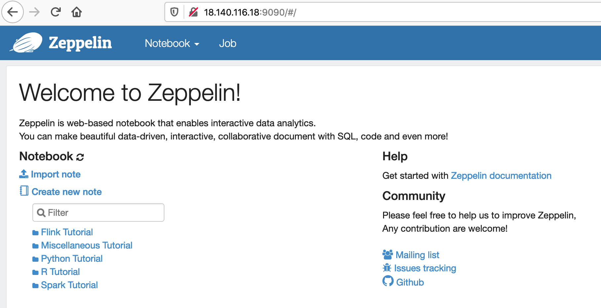
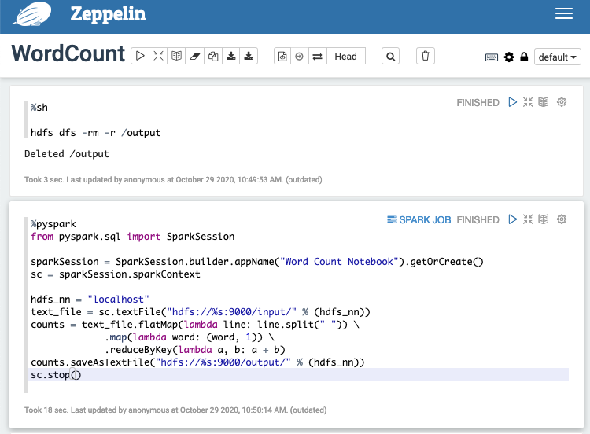

# Learning outcome


By the end of this lesson, you are able to

* Setup Zeppelin Notebook with Spark Cluster 
* Develop Data processing and ML app using Zeppelin with Spark


# Setup a Zeppelin server

Zeppelin is a web based interactive client for developing Hadoop and
Spark jobs. It is a notebook environment (similar to jupyter notebook)
with builtin support for Spark SQL and data visualiztion.

Zeppelin is a client of Spark, it can be installed within or outside
your cluster.

1. Start a hadoop/spark cluster using FlintRock. 
    
    a. (Optional) If `t2.micro` is used, enable swapfile on the namenode, (you could also enable swapfile on the datanode, but that's not a must). In your **local** machine (the one with Flintrock environment), create the following bash script `enable-swap.sh` with the following 

```bash
sudo dd if=/dev/zero of=/swapfile bs=1M count=2048
sudo mkswap /swapfile
sudo swapon /swapfile
```

Then run the following

```bash
$ flintrock copy-file my_test_cluster enable-swap.sh  /tmp/
$ flintrock run-command my_test_cluster \
'chmod u+x /tmp/enable-swap.sh'
$ flintrock run-command my_test_cluster "sudo /tmp/enable-swap.sh"
```

2. In your **local** machine (the one with Flintrock environment), create the following bash script `setup-zeppelin.sh` with the following 
content. You can find this file in the cc12 github as well. 

```bash
#!/bin/bash
echo "Downloading Zeppelin..."
cd /tmp/
wget https://downloads.apache.org/zeppelin/zeppelin-0.9.0/zeppelin-0.9.0-bin-all.tgz \ 
zeppelin-0.9.0-bin-all.tgz
tar zxvf zeppelin-0.9.0-bin-all.tgz

echo "Configuring Zeppelin..."
echo -e "
export JAVA_HOME=/usr/lib/jvm/adoptopenjdk-8-hotspot
export HADOOP_HOME=/home/ec2-user/hadoop
export SPARK_HOME=/home/ec2-user/spark
export HADOOP_CONF_DIR=\${HADOOP_HOME}/etc/hadoop
export PYSPARK_PYTHON=python3
export MASTER=yarn-client
" >> zeppelin-0.9.0-bin-all/conf/zeppelin-env.sh

cp zeppelin-0.9.0-bin-all/conf/zeppelin-site.xml.template \
zeppelin-0.9.0-bin-all/conf/zeppelin-site.xml
sed -i  "s/<value>127.0.0.1<\/value>/<value>0.0.0.0<\/value>/g" \
zeppelin-0.9.0-bin-all/conf/zeppelin-site.xml
sed -i  "s/<value>8080<\/value>/<value>9090<\/value>/g" \
zeppelin-0.9.0-bin-all/conf/zeppelin-site.xml
sed -i  "s/<value>8443<\/value>/<value>9443<\/value>/g" \
zeppelin-0.9.0-bin-all/conf/zeppelin-site.xml


mv zeppelin-0.9.0-bin-all /home/ec2-user/
rm zeppelin-0.9.0-bin-all.tgz
cd /home/ec2-user

echo "Done"
```

3. In your local machine, run the following commands. 

```bash
$ flintrock copy-file --master-only my_test_cluster setup-zeppelin.sh /tmp/
$ flintrock run-command --master-only my_test_cluster \
'chmod u+x /tmp/setup-zeppelin.sh'
$ flintrock run-command --master-only my_test_cluster \
'/tmp/setup-zeppelin.sh'
$ flintrock run-command --master-only my_test_cluster \
'/home/ec2-user/zeppelin-0.9.0-bin-all/bin/zeppelin-daemon.sh start'
$ flintrock run-command my_test_cluster 'sudo pip3 install sets numpy'
```


4. Make sure the TCP port 9090 is enabled for all source addresses. This setting can be found in the AWS EC2 Security Group with name `flintrock`

5. Navigate to `http://<public_ip_of_namenode>:9090/`, we should see Zeppelin web UI.

    a. If you are behind the SUTD firewall, port 9090 is blocked. We need to create a ssh tunnel using the following 

```bash
$ ssh -i ~/.ssh/ec2lab.pem -L 9090:127.0.0.1:9090 ec2-user@<public_ip_of_zepplin_server>
```
Then navigate to `http://127.0.0.1:9090/`.

*If you use this step, use this IP address later on in the exercises.* 
   
6. Under "anonymous -> Interpreter -> spark", change the configuration setting `zeppelin.spark.enableSupportedVersionCheck` from true to false.

7. Start a new notebook and add a cell with the following content: 
```python
%pyspark
from pyspark.sql import SparkSession

sparkSession = SparkSession.builder.appName("Word Count Notebook").getOrCreate()
sc = sparkSession.sparkContext

hdfs_nn = "172.31.31.119" # change this
text_file = sc.textFile("hdfs://%s:9000/input/" % (hdfs_nn))
counts = text_file.flatMap(lambda line: line.split(" ")) \
   .map(lambda word: (word, 1)) \
   .reduceByKey(lambda a, b: a + b)
counts.saveAsTextFile("hdfs://%s:9000/output/" % (hdfs_nn))

```

Note: I) change the `hdfs_nn` according to the internal IP of your namenode. 
II) make sure you have some data in the HDFS folder `/input/` before running the above.


# The rest of this lab

1. Change the Notebook Repo by updating the config file for permanant effect `/home/ec2-user/zeppelin-0.9.0-bin-all/conf/zeppelin-site.xml`. You can also change it from the top right dropbox 'NB repos'. Alternatively, you can import the notebooks manually from the interface as I do in the video. *In this case you can skip all the below.*

```xml
<property>
  <name>zeppelin.notebook.dir</name>
  <value>/home/ec2-user/git/istd50043-2023-spring/cohort_problems/cc12/notebook</value>
  <description>path or URI for notebook persist</description>
</property>
```

Then restart the zeppelin daemon

```bash
/home/ec2-user/zeppelin-0.9.0-bin-all/bin/zeppelin-daemon.sh restart
```

2. **Solve the questions in the Zeppelin notebooks.** The solutions are provided as hints. In some cases they are hidden (bug), so just click the original source content of the cell to unveil. 


# Appendix : Optional Exercise - setting up Zeppelin manually


## Setup Zeppelin

Assuming we have setup a Hadoop/Spark cluster manually in AWS (not via Flintrock), we now consider 
setting up Zeppelin on the mater node of the cluster.


Zeppelin is a web based interactive client for developing Hadoop and
Spark jobs. It is a notebook environment (similar to jupyter notebook)
with builtin support for Spark SQL and data visualiztion.

Zeppelin is a client of Spark, it can be installed within or outside
your cluster.

Pick one of the node, say namenode (fury)

1. Download Zeppelin

```bash
$ cd ~/download
$ wget https://downloads.apache.org/zeppelin/zeppelin-0.10.0/zeppelin-0.10.0-bin-all.tgz
```

2. Configure Zeppelin

```bash
$ tar zxvf zeppelin-0.10.0-bin-all.tgz
$ cp zeppelin-0.10.0-bin-all/conf/zeppelin-env.sh.template \
zeppelin-0.10.0-bin-all/conf/zeppelin-env.sh
$ echo -e "
export JAVA_HOME=/usr/lib/jvm/java-8-openjdk-amd64
export HADOOP_HOME=/opt/hadoop-3.3.0
export SPARK_HOME=/opt/spark-3.1.2-bin-hadoop3.2
export HADOOP_CONF_DIR=\${HADOOP_HOME}/etc/hadoop
export PYSPARK_PYTHON=python3
export MASTER=yarn-client
" >> zeppelin-0.10.0-bin-all/conf/zeppelin-env.sh

$ cp zeppelin-0.10.0-bin-all/conf/zeppelin-site.xml.template \
zeppelin-0.10.0-bin-all/conf/zeppelin-site.xml
$ sed -i  "s/<value>127.0.0.1<\/value>/<value>0.0.0.0<\/value>/g" \
zeppelin-0.10.0-bin-all/conf/zeppelin-site.xml
$ sed -i  "s/<value>8080<\/value>/<value>9090<\/value>/g" \
zeppelin-0.10.0-bin-all/conf/zeppelin-site.xml
$ sed -i  "s/<value>8443<\/value>/<value>9443<\/value>/g" \
zeppelin-0.10.0-bin-all/conf/zeppelin-site.xml
```

3. Deploy it

```bash
$ sudo mv zeppelin-0.10.0-bin-all /opt/
$ sudo chown -R hadoop:hadoop /opt/zeppelin-0.10.0-bin-all

```

4. Test

a. Start the Hadoop cluster
```bash
$ /opt/hadoop-3.3.0/sbin/start-dfs.sh && /opt/hadoop-3.3.0/sbin/start-yarn.sh
```

b. Start the Spark cluster
```bash
$ /opt/spark-3.0.1-bin-hadoop3.2/sbin/start-all.sh
```

c. Start the Zeppelin daemon
```bash
$ /opt/zeppelin-0.10.0-bin-all/bin/zeppelin-daemon.sh start
```

    d. Change the security group setting to allow  port 9090 to be accessed from the public. In the EC2 console, find 'Security Group' on the left, and add an incoming TCP rule for incoming IPv4 (anywhere). 

    e. Use your browser to access `<ip_addr_of_your_VM_running_zeppelin>:9090` , you should be able to see

	

    f. Create a new Notebook in the web UI via `Notebook -> + Create new note`

    g. Create two cells, with the first cell as

```bash
%sh

hdfs dfs -rm -r /output
```
	and the second cell as

```python

%pyspark
from pyspark.sql import SparkSession

sparkSession = SparkSession.builder.appName("Word Count Notebook").getOrCreate()
sc = sparkSession.sparkContext

hdfs_nn = "localhost"
text_file = sc.textFile("hdfs://%s:9000/input/" % (hdfs_nn))
counts = text_file.flatMap(lambda line: line.split(" ")) \
   .map(lambda word: (word, 1)) \
   .reduceByKey(lambda a, b: a + b)
counts.saveAsTextFile("hdfs://%s:9000/output/" % (hdfs_nn))
sc.stop()
```



     h. Run all cells.
