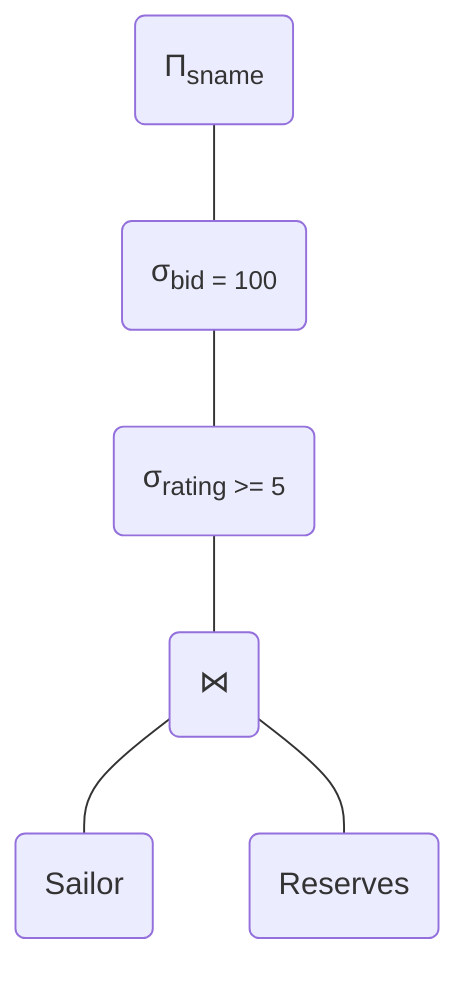
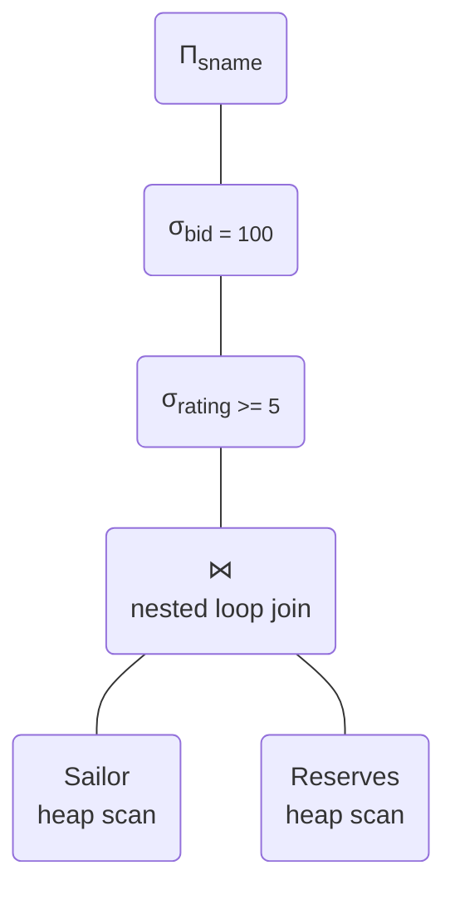
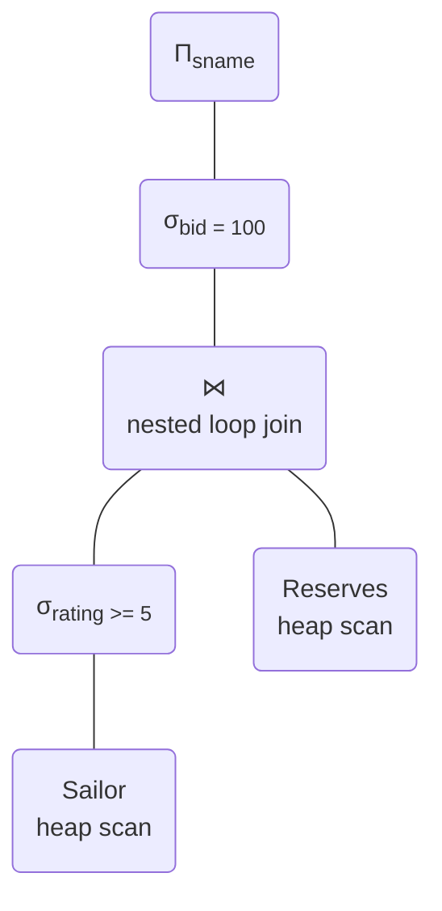
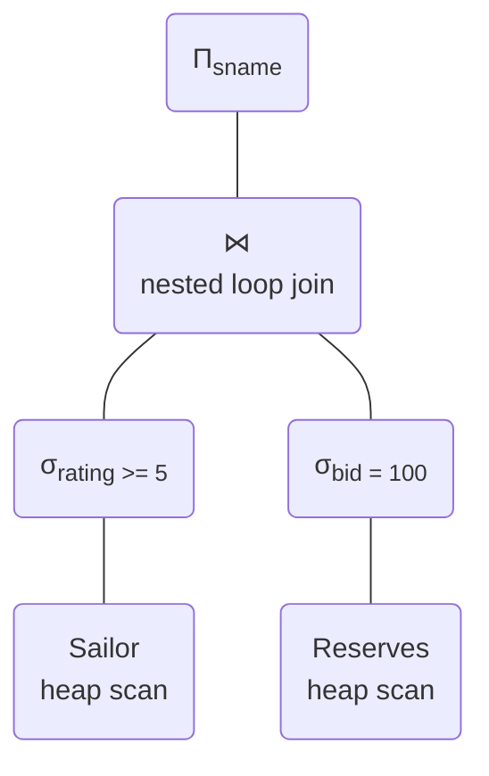
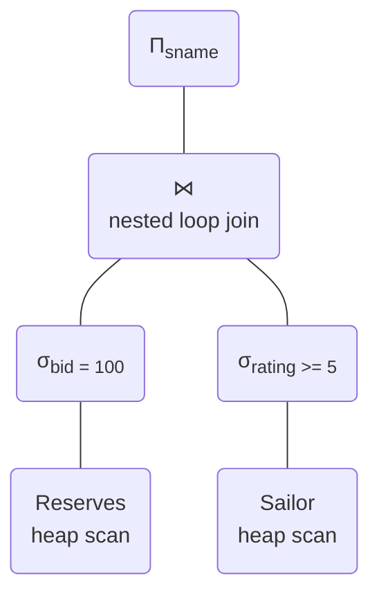
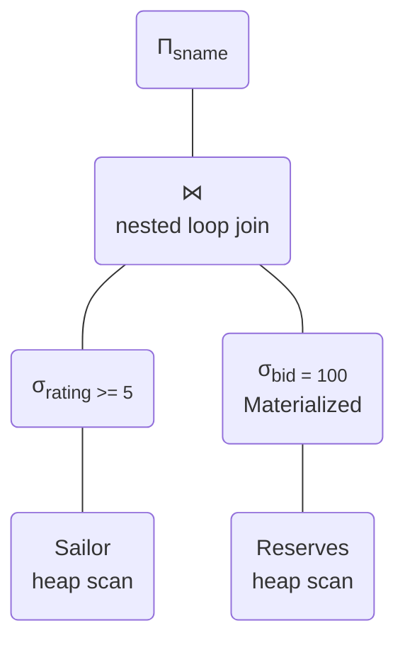
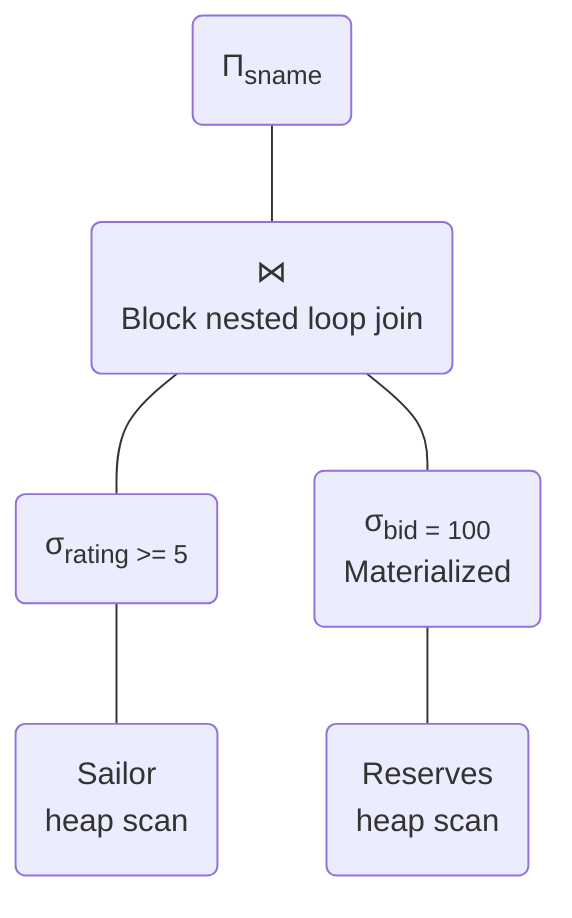
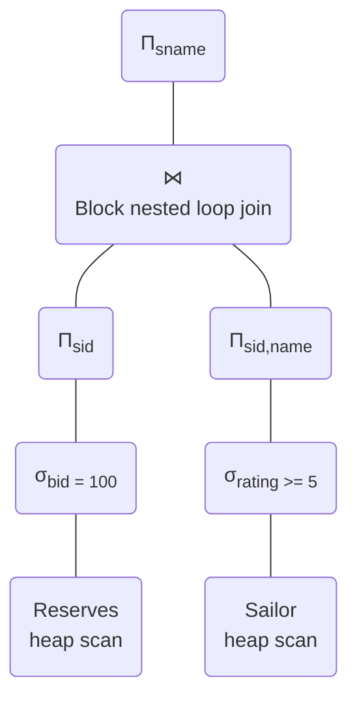
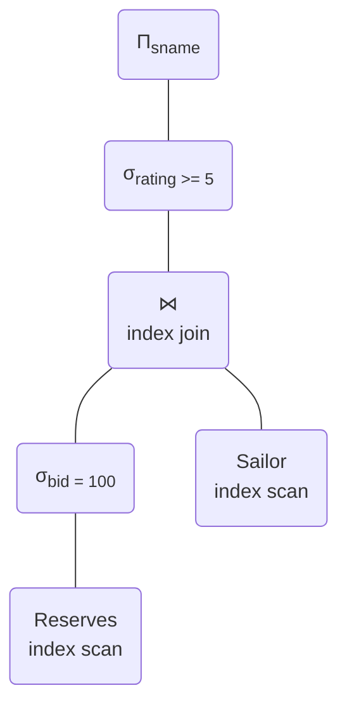

# 50.043 Query Optimization

## Learning Outocmes

By the end of this class, you should be able to

1. apply relational algebra rewriting rules to generate alternative logical query plan
1. estimate the cost of physical query plan given statistics

## Exercise 1 

Consider relation $People(salary, name, department)$, and the following relational algebra expression:​

$$
\Pi_{name}(\sigma_{salary >100}(\Pi_{name,salary}(People)))
$$

1. $\Pi_{name}(\sigma_{salary>100}(People))$
1. $\Pi_{name}(\sigma_{salary>100}(\Pi_{name}(People)))$
1. $\sigma_{salary>100}(\Pi_{name,salary}(People))$
1. $\sigma_{salary>100}(\Pi_{name}(\Pi_{name,salary}(People)))$
1. $\Pi_{name}(\sigma_{salary>100}(\Pi_{name}(\Pi_{salary}(People))))$

## Exercise 2

Consider two relation $X(A,B)$ and $Y(B,C)$ with the following statistics:​

* $N(X) = 200, V(A,X) = 100, V(B,X) = 20$​

* $N(Y) = 1000, V(B,Y) = 10, V(C,Y) = 1000$​

* $min(A,X) = 0, max(A,X)= 100$

Assuming all values of $B$ that appear in $Y$ also appear in $X$.

1. estimate the number of tuples $\sigma_{A=10}(X)$
2. estimate the number of tuples $X \bowtie Y$
3. estimate $V(A, X \bowtie Y)$​

## Exercise 3

Consider the following relations:​

* $Sailors(\underline{sid}, sname, rating, age)​$
* $Reserves(\underline{sid, bid, day})​$
* Reserves:​
    * Each tuple is 40 bytes long, 100 tuples per page, 1000 pages.
    * ​There are 100 boats (each equally likely)​
* Sailors:​
    * Each tuple is 50 bytes long, 80 tuples per page, 500 pages.
    * Assume there are 10 different ratings (1..10, each equally likely)​
* Buffer size = 5​

### Question 3.0 - What does the following query do?

### Question 3.1 - What is the cost of the following plan?

### Question 3.2 - What is the cost of the following plan?

### Question 3.3 - What is the cost of the following plan?

### Question 3.4 - What is the cost of the following plan?

### Question 3.5 - What is the cost of the following plan?

 

### Question 3.6 - What is the cost of the following plan?

### Question 3.7 - What is the cost of the following plan?

### Question 3.8 - Suppose Reserves has a clustered B+ tree index, Sailor has an unclustered B+ Tree index, both indices are in the memory. What is the cost of the following plan?

